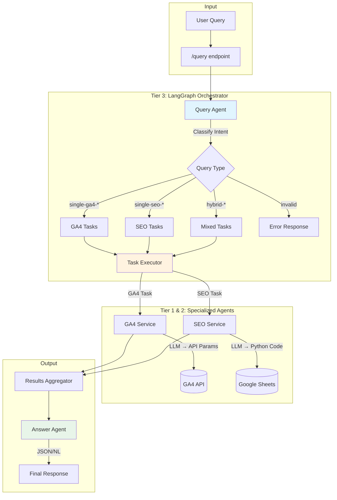
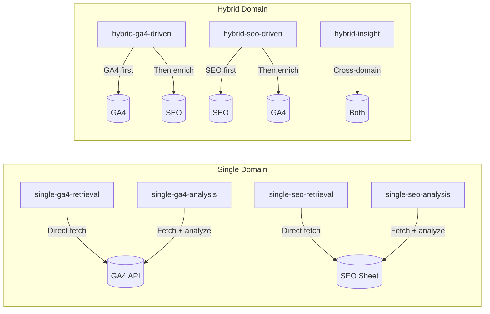
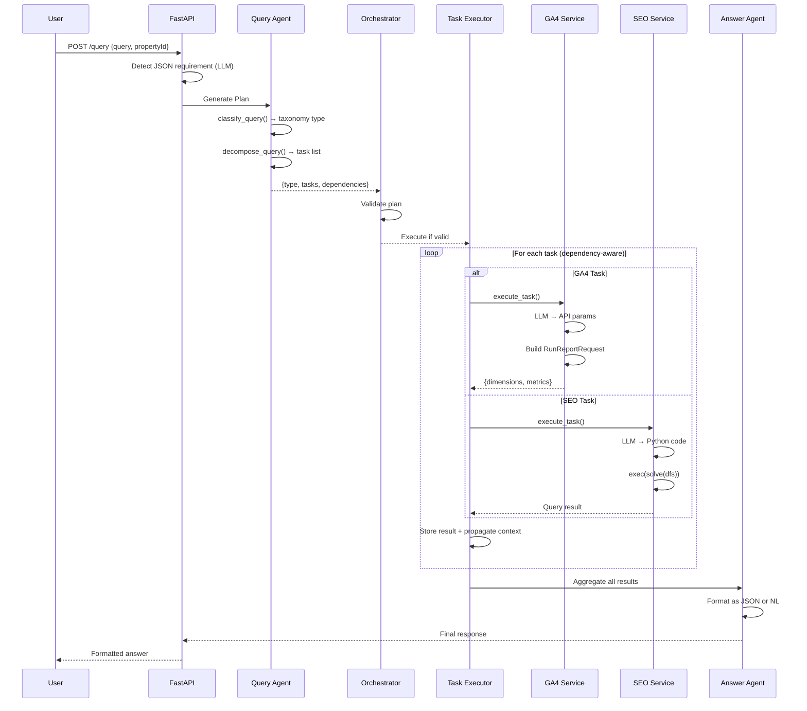
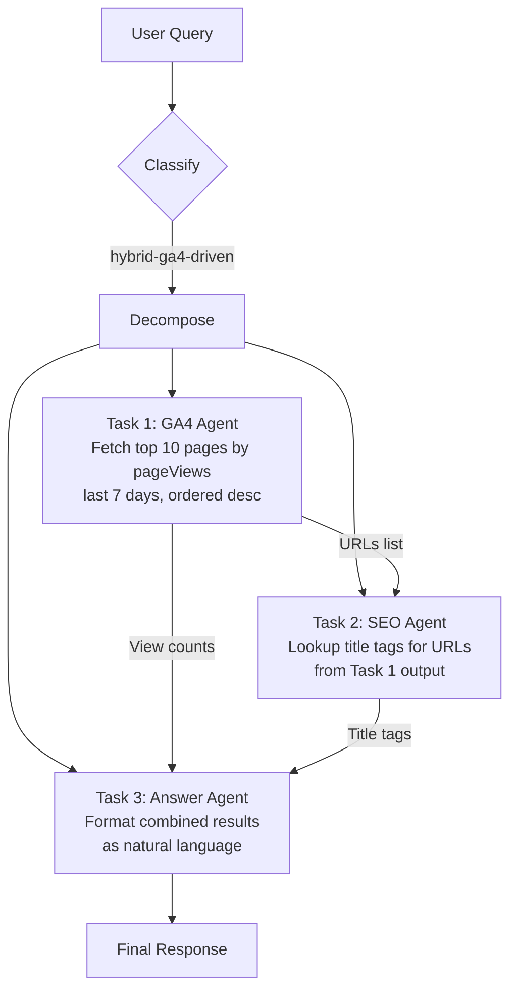

# 🔬 Web Diagnostics Orchestration

> **A Multi-Agent LLM-Powered System for Unified Web Analytics & SEO Insights**

FastAPI-based service that intelligently orchestrates web diagnostics by combining Google Analytics 4 (GA4) data with SEO audit information through an advanced multi-agent architecture.

---

## 📋 Table of Contents

- [Overview](#overview)
- [Technical Report](#technical-report)
  - [Problem Statement](#problem-statement)
  - [Our Approach](#our-approach)
  - [Architecture](#architecture)
  - [Comparison with Baseline](#comparison-with-baseline)
- [System Workflow](#system-workflow)
- [Key Features](#key-features)
- [Installation](#installation)
- [Configuration](#configuration)
- [Running the API](#running-the-api)
- [API Endpoints](#api-endpoints)
- [Example Queries](#example-queries)

---

## Overview

This system enables users to ask **natural language questions** about their website's performance and receive intelligent, aggregated responses that combine multiple data sources—without needing to understand the underlying APIs or data structures.

---

## Technical Report

### Problem Statement

Traditional web analytics and SEO auditing require:
- **Multiple tool expertise**: Users must know GA4 APIs, Screaming Frog exports, Google Sheets, etc.
- **Manual data correlation**: Joining analytics data with SEO metadata is time-consuming
- **API complexity**: Building GA4 queries requires understanding dimensions, metrics, filters, and date ranges
- **Context switching**: Moving between dashboards and tools to answer hybrid questions

### Our Approach

We built a **3-Tier Multi-Agent Orchestration System** that:

1. **Classifies** user intent using LLM-powered taxonomy detection
2. **Decomposes** complex queries into atomic executable tasks
3. **Orchestrates** task execution with dependency awareness
4. **Aggregates** results into human-readable or JSON responses

```
┌─────────────────────────────────────────────────────────────────┐
│                    TIER 3: ORCHESTRATOR                        │
│  ┌──────────────┐   ┌──────────────┐   ┌──────────────────┐   │
│  │   Intent     │──▶│    Query     │──▶│   Dependency     │   │
│  │   Classifier │   │  Decomposer  │   │   Resolver       │   │
│  └──────────────┘   └──────────────┘   └──────────────────┘   │
└─────────────────────────────────────────────────────────────────┘
                              │
          ┌───────────────────┴───────────────────┐
          ▼                                       ▼
┌─────────────────────────┐         ┌─────────────────────────┐
│   TIER 1: GA4 AGENT     │         │   TIER 2: SEO AGENT     │
│  ┌───────────────────┐  │         │  ┌───────────────────┐  │
│  │  LLM Query Parser │  │         │  │  LLM Code Generator│  │
│  │  GA4 API Wrapper  │  │         │  │  Pandas Executor   │  │
│  │  Data Normalizer  │  │         │  │  GSheet Cache      │  │
│  └───────────────────┘  │         └──┴───────────────────┴──┘
└─────────────────────────┘
```

### Architecture

The system uses **LangGraph** for state-machine based orchestration:



### Query Classification Taxonomy



### Comparison with Baseline

| Aspect | Baseline (Manual) | Our System |
|--------|-------------------|------------|
| **Query Interface** | Multiple APIs/UIs | Single natural language endpoint |
| **GA4 Queries** | Manual API param construction | LLM auto-generates valid params |
| **SEO Data Access** | Export → Excel → Manual analysis | Auto-cached sheets + LLM-generated Pandas |
| **Hybrid Analysis** | Manual data joining in spreadsheets | Automatic context-aware task chaining |
| **Output Format** | Raw data needing interpretation | Human-readable summaries or structured JSON |
| **Learning Curve** | High (API docs, data schemas) | Zero (just ask in English) |
| **Response Time** | Minutes (manual correlation) | Seconds (automated pipeline) |

#### Key Improvements Over Baseline

1. **🧠 Intent Understanding**: LLM classifies queries into 8 taxonomy types, enabling smart routing
2. **🔗 Automatic Data Correlation**: Hybrid queries automatically join GA4 URLs with SEO metadata
3. **📊 Dynamic Code Generation**: SEO agent generates custom Pandas code for any query pattern
4. **⚡ Dependency-Aware Execution**: Tasks execute in correct order with context propagation
5. **🎯 Format-Aware Output**: Detects if user wants JSON vs natural language responses

---

## System Workflow

### End-to-End Request Flow



### Task Decomposition Example

For query: *"Top 10 pages by views last week with their SEO titles"*



---

## Key Features

| Feature | Description |
|---------|-------------|
| **🔀 Multi-Agent Architecture** | Specialized agents for GA4 and SEO with LLM-powered task understanding |
| **📝 Natural Language Queries** | Ask questions in plain English—no API knowledge required |
| **🔄 Hybrid Query Support** | Seamlessly combine analytics and SEO data in single queries |
| **⚡ Smart Caching** | SEO workbook cached for 5 minutes, reducing API calls |
| **🎨 Flexible Output** | Auto-detects desired format (JSON/natural language) |
| **📊 Dynamic Analysis** | LLM generates custom Pandas code for complex SEO queries |
| **🛡️ Error Resilience** | Retry logic with exponential backoff for rate limits |

---

## Installation

### Prerequisites

- **Python**: 3.11+ (pinned via `.python-version`)
- **uv**: Python package manager ([install guide](https://github.com/astral-sh/uv))

### Setup

```bash
# Clone the repository
git clone <YOUR_REPO_URL> web-diagnostics-orchestration
cd web-diagnostics-orchestration

# Install dependencies with uv
uv sync
```

This creates a virtual environment and installs all dependencies from `pyproject.toml`.

---

## Configuration

### Environment Variables

Create a `.env` file in the project root:

```bash
# Application
APP_ENV=development

# Google Analytics 4
GA4_PROPERTY_ID=<your-ga4-property-id>

# LiteLLM Proxy (for LLM calls)
LITELLM_PROXY_URL=<your-litellm-proxy-url>
LITELLM_KEY=<your-litellm-api-key>

# Google Services
SERVICE_ACCOUNT_MAIL=<your-service-account-email>
SHEET_ID=<your-google-sheet-id>
GOOGLE_APPLICATION_CREDENTIALS=credentials.json

# Agent Configuration
AGENT_TAXONOMY_PATH=agent_taxonomy.json
```

### Credentials

Place your Google service account JSON as `credentials.json` in the project root.

---

## Running the API

### Development Mode

```bash
# Using uv (recommended)
uv run python -m app.main

# Or using uvicorn directly with hot reload
uv run uvicorn app.main:app --host 0.0.0.0 --port 8080 --reload
```

The server starts at `http://0.0.0.0:8080`

### Interactive Documentation

Once running, access:
- **Swagger UI**: http://localhost:8080/docs
- **ReDoc**: http://localhost:8080/redoc

---

## API Endpoints

| Method | Endpoint | Description |
|--------|----------|-------------|
| `GET` | `/health` | Health check |
| `GET` | `/sheets` | List available SEO sheet names |
| `GET` | `/creds` | View loaded credentials (dev only) |
| `POST` | `/query` | **Main endpoint** - Execute natural language query |

### Query Endpoint

```bash
POST /query
Content-Type: application/json

{
  "query": "What are the top 5 pages by views in the last 30 days?",
  "propertyId": "123456789"
}
```

---

## Example Queries

### Single-Domain Queries

```
# GA4 Retrieval
"Show me page views for /pricing page last 14 days"

# GA4 Analysis  
"What's the trend in sessions over the last month?"

# SEO Retrieval
"List all pages with 404 status codes"

# SEO Analysis
"What percentage of pages have missing meta descriptions?"
```

### Hybrid Queries

```
# GA4-Driven Hybrid
"Top 10 pages by traffic with their SEO title tags"

# SEO-Driven Hybrid  
"Pages with broken links and their current traffic"

# Cross-Domain Insight
"Which high-traffic pages have poor SEO scores?"
```

### Output Format Control

```
# Natural language (default)
"Summarize the traffic trends for the homepage"

# JSON output
"Give me the top 5 landing pages in JSON format"
```

---

## Project Structure

```
web-diagnostics-orchestration/
├── agent.py                 # LangGraph orchestration graph
├── agent_taxonomy.json      # Query classification taxonomy
├── main.py                  # Entry point
├── pyproject.toml           # Dependencies
├── credentials.json         # Google service account (gitignored)
├── .env                     # Environment variables (gitignored)
└── app/
    ├── main.py              # FastAPI application
    ├── config.py            # Settings management
    ├── models.py            # Pydantic models
    ├── orchestrator.py      # Tier 3: Intent & planning logic
    ├── agents/
    │   ├── analytics_agent.py   # Tier 1: GA4 logic
    │   └── seo_agent.py         # Tier 2: SEO logic
    └── services/
        ├── ga4_service.py       # GA4 API wrapper
        ├── seo_gsheet_service.py # Google Sheets + Pandas
        └── llm_service.py       # LLM utilities
```

---

## Tech Stack

- **FastAPI** - Modern async web framework
- **LangGraph** - State machine orchestration for multi-agent workflows
- **OpenAI SDK** - LLM interactions (via LiteLLM proxy)
- **Google Analytics Data API** - GA4 reporting
- **Pandas** - Dynamic SEO data analysis
- **Pydantic** - Settings and validation

---

## License

MIT License - See LICENSE file for details.
