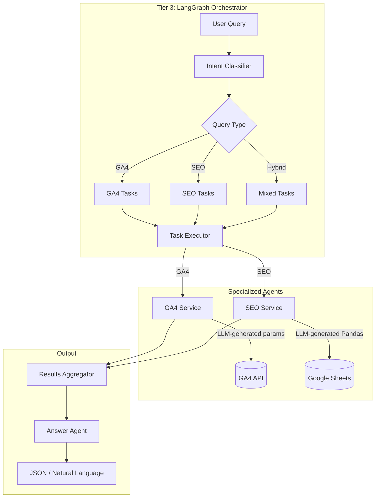

# Web Diagnostics Orchestration

Multi-agent system for unified web analytics and SEO insights. Ask natural language questions about website performance and get intelligent responses that combine Google Analytics 4 data with SEO audit information.



## Features

- **3-tier multi-agent architecture** -- Intent classification, query decomposition, and dependency-aware task orchestration via LangGraph state machine
- **Natural language interface** -- Single `/query` endpoint translates English questions into GA4 API calls and Pandas operations
- **Hybrid query support** -- Automatically correlates analytics data with SEO metadata across data sources
- **Dynamic code generation** -- SEO agent generates custom Pandas code for arbitrary query patterns against cached Google Sheets data
- **Smart caching** -- SEO workbook cached for 5 minutes with automatic refresh
- **Flexible output** -- Auto-detects whether the user wants JSON or natural language responses

## Query Classification Taxonomy

| Type | Description |
|------|-------------|
| `single-ga4-retrieval` | Direct GA4 data fetch |
| `single-ga4-analysis` | GA4 fetch + LLM analysis |
| `single-seo-retrieval` | Direct SEO sheet lookup |
| `single-seo-analysis` | SEO fetch + analysis |
| `hybrid-ga4-driven` | GA4 first, enrich with SEO |
| `hybrid-seo-driven` | SEO first, enrich with GA4 |
| `hybrid-insight` | Cross-domain correlation |

## Quick Start

```bash
# Prerequisites: Python 3.11+, uv
git clone https://github.com/Akasxh/web-diagnostics-orchestration.git
cd web-diagnostics-orchestration
uv sync

# Configure environment
cp .env.example .env  # fill in GA4_PROPERTY_ID, LITELLM_KEY, SHEET_ID, etc.

# Run
uv run uvicorn app.main:app --host 0.0.0.0 --port 8080 --reload
```

API docs available at `http://localhost:8080/docs` (Swagger) and `/redoc`.

## API

| Method | Endpoint | Description |
|--------|----------|-------------|
| `POST` | `/query` | Execute natural language query |
| `GET` | `/health` | Health check |
| `GET` | `/sheets` | List available SEO sheet names |

```bash
curl -X POST http://localhost:8080/query \
  -H "Content-Type: application/json" \
  -d '{"query": "Top 10 pages by views last week with their SEO titles", "propertyId": "123456789"}'
```

## Project Structure

```
web-diagnostics-orchestration/
├── agent.py                     # LangGraph state machine (plan → orchestrate → execute → respond)
├── agent_taxonomy.json          # Query classification taxonomy definitions
├── main.py                      # Entry point
├── pyproject.toml
├── app/
│   ├── main.py                  # FastAPI application
│   ├── config.py                # Pydantic Settings
│   ├── models.py                # Request/response models
│   ├── orchestrator.py          # Intent classification + query decomposition
│   ├── agents/
│   │   ├── analytics_agent.py   # GA4 agent (LLM → API params → RunReportRequest)
│   │   └── seo_agent.py         # SEO agent (LLM → Pandas code → exec)
│   └── services/
│       ├── ga4_service.py       # GA4 Data API wrapper
│       ├── seo_gsheet_service.py # Google Sheets + Pandas caching layer
│       └── llm_service.py       # OpenAI SDK utilities (via LiteLLM proxy)
└── credentials.json             # Google service account (gitignored)
```

## Tech Stack

| Component | Technology |
|-----------|-----------|
| API | FastAPI, uvicorn |
| Orchestration | LangGraph (state machine) |
| LLM | OpenAI SDK via LiteLLM proxy |
| Analytics | Google Analytics Data API (GA4) |
| SEO Data | Google Sheets API + Pandas |
| Validation | Pydantic v2, pydantic-settings |
| Package Manager | uv |

## License

MIT
